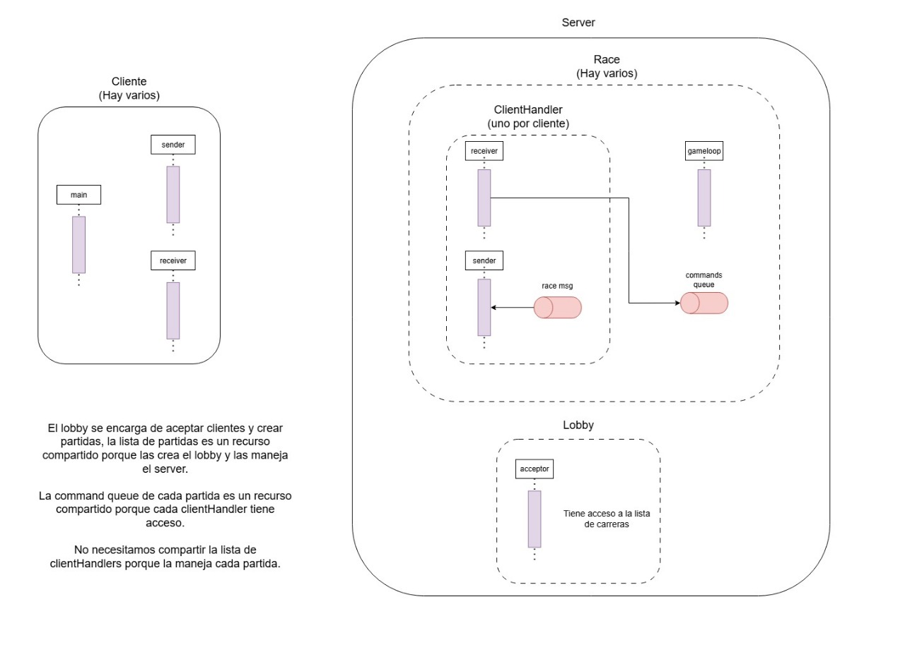
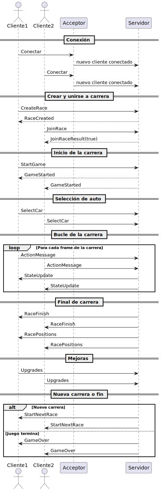
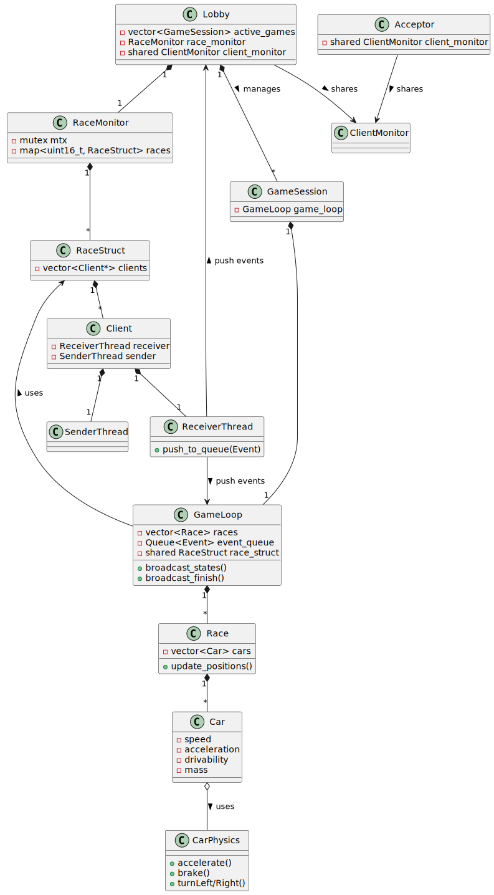

# Documentación Técnica

La arquitectura de este trabajo práctico se basa en un sistema multicliente, para un videojuego de carreras multijugador en línea, que busca la comunicación constante entre cliente-servidor para la realización de todo tipo de conexion y sincronización de los jugadores.

## Protocolo de comunicación
El juego cuenta con un protocolo de comunicación, que se centra en la serialización y deserialización de los mensajes presentes en sus dos DTO, ClientMessageDTO y ServerMessageDTO. Esta tarea es llevada a cabo por las clases MessageReceiver (para la deserialización) y MessageSender (para la serialización). A su vez, utiliza un socket bloqueante para el envío de los mensajes, que ya cuentan con formato binario gracias a su preprocesamiento de serialización.

## Sistema de hilos

### Cliente
Principalmente cuenta con un sistema de comunicacion de tres hilos de parte del cliente, comunicados por colas thread safe:
- Hilo de dibujo: En un principio funciona como lobby, comunicandose de forma sincrónica, enviando y esperando respuesta de forma bloqueante del servidor. Una vez comenzado el juego pasa a comunicarse de forma asincrónica, mediante sus hilos de comunicación listados debajo y una cola de eventos propia, para de esta manera no sufrir de bloqueos que impidan su correcto funcionamiento. Ante cada evento del tipo StateUpdate redibuja la pantalla, teniendo en cuenta las nuevas posiciones de los jugadores de acuerdo a la información recibida de parte del servidor.
- Hilo receiver: Encargado de recibir los mensajes del servidor y encolarselos en una cola de eventos al hilo de dibujo del cliente
- Hilo sender: Recibe en su cola los mensajes a ser enviados al servidor y mediante el protocolo de comunicación y el dto ClientMessageDTO se comunica con el servidor.

### Servidor
Por el lado del servidor, se cuenta con una mayor cantidad de hilos, que permiten correr varias carreras en simultaneo, aceptar y eliminar clientes y manejar los mensajes de aquellos que se encuentran fuera de una carrera. Los hilos presentes son estos:

- Principal: Funciona como disparador del sistema y permite finalizar la ejecución del servidor mediante el envio del caracter "q"
- Acceptor: Tiene como objetivo estar en todo momento escuchando la llegada de nuevos clientes. Utiliza un socket aceptador para recibir el intento de comunicación, lo redistribuye a un nuevo socket y crea los hilos sender y receiver de cada cliente recepcionado, agrengadolos a MonitorClients
- Lobby: Es el encargado de recibir las comunicaciones previo al ingreso de los clientes a una sesion de carreras. Crea y elimina los lobbys de cada partida, elimina y asigna clientes a uno de estos lobbys, de acuerdo a sus pedidos. Además, contiene las sesiones de gameloop hasta que son finalizadas.
- Sender y Receiver: Cada cliente tiene asignado un hilo receiver y sender, englobados dentro de la clase ClientHandler, que al igual que del lado del cliente, son los encargados de recepcionar y enviar los mensajes vía protocolo y comunicarse con el resto de hilos mediante colas thread safe. En un principio se comunican con la cola de lobby, para una vez comenzada una sesión, pasar a encolar sus mensajes en su respectivo gameloop.

### Diagrama de hilos

## Funcionamiento

### Lobby
Mientras se encuentren en el lobby, los clientes podrán crear una sesión, lo que les brindará un id, con el que otros clientes pueden optar por unirse a ella, con un limite de 8 jugadores dentro.
Además, dentro de cada lobby, podrán optar por un auto en específico, dentro de los disponibles, basandose en sus características de velocidad, manejo, aceleracion, masa y salud. En caso de que no se opte por ninguno de ellos previo a que se envie por parte de uno de los demás clientes el inicio del juego, el servidor elegirá de manera al azar uno de los autos presentes para que este cliente utilice.

### Durante la carrera
Durante la carrera, todos los clientes presentes en ella recibirán mensajes de broadcast de parte del servidor, ya sea para actualizar las posiciones, checkpoints y estados del auto, como para recibir las posiciones, mapa utilizado durante la carrera o actualizaciones de penalizaciones y mejoras del auto durante los intervalos entre carreras consecutivas.
De parte del cliente, se estará constantemente escuchando eventos mediante los Keyhandler de SDL. Cuando los comandos son escuchados, se agregan a un vector de acciones que sera enviado en cada frame al servidor para ser interpretado y que actualice los estados

Esos mensajes son enviados via protocolo y se utiliza la clase que cuenta con un mutex RaceMonitor, con el objetivo de tener seguridad frente al acceso multithread de los clientes dentro de la carrera.

De parte del cliente, calcula la iteración en la que se encuentra presente mediante la clase GameloopTimer, para redibujar los estados de cada uno de los autos corriendo, pero evitando, gracias a los sleep y saltos de iteraciones defasadas, mantener un estado desactualizado del real.

### Diagrama de secuencia

### Diagrama de clases

### Editor
El proyecto cuenta con un editor visual de carreras, que permite diseñar circuitos de forma interactiva antes de iniciar una partida.
El editor puede:

- Cargar cualquiera de los tres mapas por defecto (Liberty City, Vice City o San Andreas).

- Crear nuevas carreras dentro de estos mapas utilizando un sistema de drag and drop de elementos, entre los que se incluyen:
    - posiciones de largada
    - checkpoints
    - zonas de finalización
    - hints e indicadores

Permitir la edición libre del escenario, pudiendo incluso crear un mapa completamente nuevo diferente a los predefinidos.

Toda la información configurada dentro del editor se exporta en un archivo YAML, que representa la carrera diseñada.
Este archivo debe ser colocado en:

[server/assets/race_configs](../server/assets/race_configs/)

para que pueda ser posteriormente seleccionado y utilizado por el servidor al momento de iniciar una partida.

### Configuraciones
El sistema cuenta con una arquitectura altamente configurable mediante archivos YAML, permitiendo ajustar múltiples parámetros sin necesidad de recompilar el proyecto:

#### Definiciones de autos:
Cada vehículo tiene su propio bloque de configuración dentro del YAML, donde se especifican parámetros como su tamaño y estadísticas base. Además, dentro del archivo se encuentran las constantes físicas utilizadas por el motor físico (fricción, velocidad base, límites de choque, factores de giro, etc.).
Esto permite modificar el comportamiento del juego sin intervenir en el código fuente.

#### Mapas, colisiones, esquinas y puentes:
Cada mapa posee un archivo YAML asociado donde se definen:

- Boxes de colisiones
- Posiciones de edificios
- Zonas de esquinas y obstáculos
- Información sobre puentes o elevaciones

Estos archivos son utilizados por el constructor de colisiones del servidor para generar los objetos físicos del mapa.

#### Configuración del cliente:
La resolución de la ventana se puede configurar en [game_config](../client/config/game_config.yaml)

#### Compilación:
El proyecto utiliza CMake, con CMakeLists distribuidos tanto en el cliente como en el servidor.
Estos archivos permiten compilar automáticamente todos los componentes del proyecto y además instalar las dependencias externas necesarias (como SDL2, Google tests o Qt, según la parte del proyecto que corresponda).

