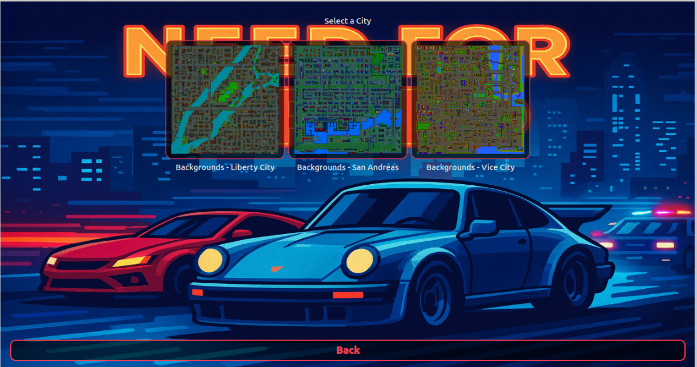
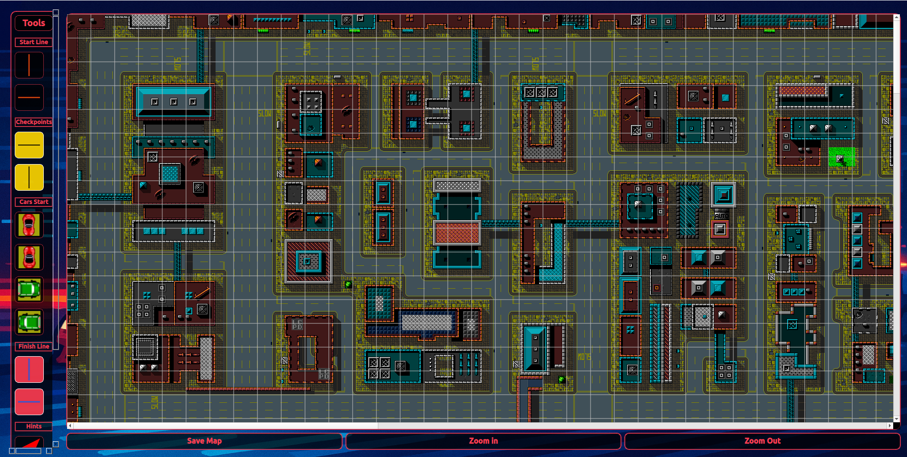

# Manual de Usuario

## Instalación
Para la instalación del juego, se debe utilizar un sistema operativo Ubuntu 24.04 (o en su versión más ligera Xubuntu 24.04). En la carpeta raíz del proyecto se deberán ejecutar los siguientes comandos, para instalar las dependencias y los ejecutables del proyecto.

<pre>
user@host:~/tp-taller-g4$ chmod +x installer.sh
user@host:~/tp-taller-g4$ ./installer.sh
</pre>

## Desintalación 
Para la desintalación del juego es muy similar a cómo se instala.

<pre>
user@host:~/tp-taller-g4$ chmod +x uninstaller.sh
user@host:~/tp-taller-g4$ ./uninstaller.sh
</pre>

## Instrucciones de Juego

### Ejecución del servidor

En una terminal, se debera correr el comando:
<pre>
user@host:~$ ./NEED4SPEED-server xxxx
</pre>
Donde xxxx debera ser reemplazado por una serie de 4 numeros que representaran el puerto donde correra escuchara comunicaciones el servidor. Se recomienda 8080 como un puerto recomendado para recibir las comunicaciones.

### Ejecucion del cliente

En caso de que se quiera ejecutar localmente el juego, en otra terminal se deberá ejecutar el siguiente comando, utilizando en lugar de xxxx los 4 numeros de puerto establecidos en el servidor.
<pre>
user@host:~$ ./NEED4SPEED-client localhost xxxx
</pre>
Si se prefiere ejecutarlo por red, se deberá ejecutar de la siguiente manera
<pre>
user@host:~$ ./NEED4SPEED-client  &lt;ipv4 host&gt; xxxx
</pre>

### Lobby
Una vez lanzado el cliente, contarás con las siguientes posibilidades: Crear una partida o unirte a una de ellas.

En caso de crear una partida, recibirás un id de partida, recordalo, deberá ser el que compartas con la persona que quieras jugar. Igualmente aparecera en la parte inferior del lobby

Por otro lado, si deseas unirte a una partida ya existente, deberas hacer click en join game y escribir el numero de id de la partida a la que quieras unirte. En caso de que este llena, ya comenzada o sea inexistente dará error, en caso contrario te unirás a ella. El limite de jugadores es de máximo 8 en la misma partida.

Una vez ingresado en una partida, deberás seleccionar uno de los autos que se te muestren, será con el que correrás todas las carreras. Igualmente, podras asignarle modificaciones luego de cada carrera, costandote un tiempo de penalización para el siguiente resultado.

Estando en el lobby de la partida elegida, al hacer click en start race, comenzará la partida para todos los integrantes de la misma.

### Carrera

Al iniciar la carrera, se mostrará un contador de 10 segundos previo al arranque de la misma. Una vez en ella, deberas seguir las ayudas mostradas en forma de flecha, para llegar así a los checkpoints, marcados con una linea blanca sobre las calles.
Las teclas para el movimientos seran W (arriba), A (izquierda), S (reversa y freno) y D (derecha)

Al mismo tiempo, contarás con un minimapa en la pantalla que te mostrará el camino a seguir, teniendo en cuenta los checkpoints.
Contarás con una vida inicial, que ira disminuyendo ante cada choque, variando la cantidad de daño recibido de acuerdo a la intensidad y fuerza del impacto.

La carrera finalizará cuando se de alguna de las siguientes situaciones:
- Todos los jugadores llegaron a la linea de meta o disminuyeron su vida a 0, explotando su auto
- Transcurrieron 10 minutos desde la largada, dando por finalizada la carrera a todos aquellos que no hayan llegado a la meta.

### Post-Carrera

Al finalizar la carrera, se darán las posiciones y tiempos que se hayan obtenido en la misma. Posteriormente, se mostrarán las posiciones y tiempos acumulados durante todas las carreras que se hayan realizado.

### Intervalo
Luego de mostrar las posiciones, se dara un intervalo de 10 segundos, en los que se permitirá realizarle mejoras de aceleracion, velocidad maxima, salud, controlabilidad y masa al auto con el que te encontras corriendo. Cuidado, cada una de ellas te costará una penalizacion de tiempo para la siguiente carrera.

### Cheats
El juego cuenta con ciertas teclas especiales, que permitirán las siguientes acciones:
- Finalizar la carrera en el momento en que es presionada (K)
- Explotar nuestro auto, generando que perdamos la carrera (J)
- Maximizar las estadisticas del auto en el que estemos (M)
- Establecer vida infinita para el auto que manejamos (I)

## Editor de carreras

En la instalación del juego base contaras con mapas y carreras por defecto. Igualmente, cuenta con un editor de niveles, que permitirá crear tu propia carrera.
Su ejecución se realiza de la siguiente manera:

<pre>
user@host:~$ NEED4SPEED-editor
</pre>

El editor permitira cargar una carrera ya realizada o crear una nueva seleccionando mapa. Para editar una carrera, debemos elegir load yaml, y elegir el archivo .yaml correspondiente a esa carrera. En cambio, si queremos crear una nuvea seleccionamos select map y elegimos en que mapa queremos que se desarrolle. Entonces, se abrira la siguiente ventana, que nos permitira elegir el mapa donde elaboraremos el circuito.

En esta pantalla, mediante el arrastre de los elementos de la barra izquierda, podremos establecer los puntos de respawn, los checkpoints y sus hints. En caso de querer borrar un elemento, se deberá hacer `click derecho` sobre él.
Cada uno de los hints (flechas de indicacion) que se quieran establecer deberán asociarse a una de las lineas de checkpoint previamente establecida, haciendo `click izquierdo` sobre ellas, una vez ubicada la pista. En caso de querer cancelar la elección del hint, aprentar `ESC`.
Además, se ofrece un grilla de guía para ubicar mejor los elementos. En caso de querer moverlos con seleccionar el elemento en grilla, podes moverlo a donde quiera. Por último, para poder hacer `ZOOM` del mapa, hay dos botones `ZOOM IN` y `ZOOM OUT`.

El editor te pedirá obligatoriamente lo siguiente:
- 8 puntos iniciales para los autos
- 1 Linea de meta
- 1 Linea inicial
- Minimo 2 checkpoints

Una vez finalizado, guardamos el mapa y lo llevamos a la carpeta server/assets/race_configs (Carpeta establecida por defecto para el guardado de los archivos .yaml de carreras). Al querer editar un mapa ya existente, automáticamente se abrirá ese directorio (carpeta donde están todos los mapas) y seleccionarás el mapa deseado.

